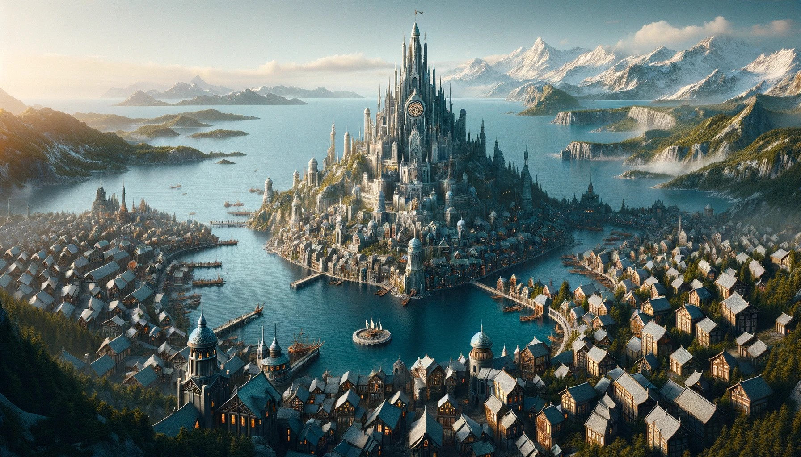
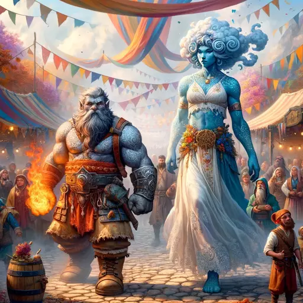

# Welcome to Jotunvik

A city of wonders nestled in the embrace of towering cliffs and expansive bays, where the majestic sea meets the rugged beauty of the land. Here, in this Norse-inspired metropolis, giants walk alongside the smaller folk, their presence as natural as the stone and sea. Jotunvik is not just a city; it is a testament to the possibility of harmony between beings of all sizes and origins.

As you step into this vibrant world, you'll find yourself in a society governed by the Stewards of the Eternal Throne, a council of giants who believe themselves the benevolent guardians of the land. Their rule has fostered a city where architectural marvels defy the imagination, with grand halls and towering spires coexisting alongside cozy inns and bustling marketplaces, all designed to cater to citizens both large and small.

The heart of Jotunvik beats strongest at its harbor, where ships from distant lands bring goods and tales of the world beyond. Here, giants and humans work side by side, unloading treasures from afar, while the air is filled with the sounds of commerce and the salty tang of the sea. Venture into the city, and you'll find the markets, a kaleidoscope of sights, smells, and sounds. Stalls brimming with exotic spices sit next to craftsmen selling magical artifacts, each vendor ready with a smile and a story.

But Jotunvik is more than its bustling economy and grandiose architecture. It is a city of diverse cultures and traditions, where festivals light up the night and tales of old are shared by the fireside. From the revered Rune Crafters' Guild, guardians of magical knowledge, to the adventurous souls of the Vanguard of the Veil, the city thrives on the spirit of its inhabitants.

Despite the idyllic facade, life in Jotunvik is not without its challenges. The giants, for all their wisdom and longevity, sometimes fail to grasp the urgency of the smaller races' lives, leading to tensions and misunderstandings. Yet, it is in the resolution of these differences that Jotunvik finds its strength, as its people come together to solve problems and bridge gaps, proving that unity can be found in diversity.

As adventurers, you are drawn to Jotunvik not just by tales of its splendor but by the promise of the unknown and the thrill of discovery. Whether you seek to uncover ancient secrets, forge alliances with powerful factions, or simply find your place in this extraordinary city, your journey is just beginning. Here, in Jotunvik, every street corner tells a story, and every shadow hides a mystery waiting to be unraveled.

So, gather your courage and your wits, for you are about to embark on a journey unlike any other. Welcome to Jotunvik, where legends walk the earth and adventure awaits at every turn.

